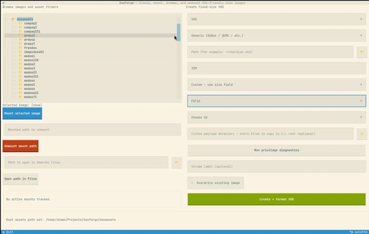

# dosforge

`dosforge` is a DOS-focused image utility that runs on **Linux** (with a
full Textual TUI + kernel-mount workflow) and **Windows** (CLI-first,
no admin, no sudo, no kernel modules — single portable `dosforge.exe`).

It can create, browse, and modify:

- fixed-size **VHD** images (FAT12/FAT16/FAT32)
- floppy **IMG/IMA/VFD** images (FAT12)

with optional boot/system-file staging for FreeDOS, MS-DOS 7.1, MS-DOS
3.3 / 3.31 / 5.0 / 6.22, PC-DOS / PC-DOS 7.0 / **PC-DOS 7.1 (FAT32)**,
Compaq DOS 3.31, and IBM 8088/V20 (DOS 3.3 / 5.0).

## Platform support

| Feature | Linux | Windows | Notes |
|---|:---:|:---:|---|
| Create VHD (all 12 boot modes) | ✅ | ✅ | every mode produces a bootable VHD |
| Create floppy IMG (8 sizes, bootable + non-bootable) | ✅ | ✅ | |
| `--dos-install-profile {minimal,full}` | ✅ | ✅ | C:\DOS\ tools tree on FULL |
| MartyPC Xebec / XT-IDE / JR-IDE machine targets | ✅ | ✅ | all 127 AT geometries + 4 Xebec types |
| `.7z` auto-extract (WinWorldPC archives) | ✅ | ✅ | drop into `dosassets/<mode>/`, transparent unpack |
| Custom-payload directory copy | ✅ | ✅ | VHD + IMG, both platforms |
| `dosforge ls / cat / get / put / rm / mkdir` | ✅ | ✅ | mtools-based, no mount required |
| `dosforge mount / unmount` | ✅ | ❌ | Linux-only (qemu-nbd + kernel mount). On Windows use the `ls/cat/get/put/rm/mkdir` verbs instead. |
| `open_in_files` | ✅ (xdg-open) | ✅ (Explorer) | |
| Textual TUI | ✅ | ⚠️ | TUI works but is iterated on the CLI surface; richer support on Linux. |

## Demo

https://github.com/user-attachments/assets/90a2c9c1-31c0-4d65-88cc-2e0df4d8758e

<details>
<summary>Player not visible? Other ways to watch.</summary>

- **Click the thumbnail below to open the MP4 in a new tab:**

  <a href="https://github.com/flynnsbit/dosforge/releases/download/v0.2.1/dosforge-demo.mp4"
     title="Click to play the dosforge demo">
    
  </a>

- **Release asset:** <https://github.com/flynnsbit/dosforge/releases/download/v0.2.1/dosforge-demo.mp4>
- **From the repo tree:** [`assets/demo/dosforge-demo.mp4`](assets/demo/dosforge-demo.mp4)

</details>

## Highlights

- Dynamic TUI create flow with top-level **Media type** selector (**VHD** default, **IMG** optional)
- Progressive disclosure UI (only relevant options are shown)
- Bootable/system-format support for:
  - FreeDOS
  - MS-DOS 7.1
  - IBM DOS 3.3 / 5.0
  - MS-DOS 3.3 / 3.31 / 5.0 / 6.22
  - PC-DOS / PC-DOS 7.0 (XDF)
  - **PC-DOS 7.1** — the only PC-DOS variant with FAT32 + LBA support; uses a QEMU-driven `FORMAT32 /S` install (see [`vogons.org/viewtopic.php?t=93030`](https://www.vogons.org/viewtopic.php?t=93030))
  - Compaq DOS 3.31
- **mtools-based image content verbs** (`ls`, `cat`, `get`, `put`, `rm`, `mkdir`) — browse and edit any VHD/IMG without mounting it; auto-detects the first MBR partition on VHDs.
- **Emulator-specific machine targets** — generic (86Box / QEMU) plus
  MartyPC IBM/Xebec, MartyPC XT-IDE, and MartyPC JR-IDE with the exact
  CHS geometries each controller validates against
- Automatic DOS boot-template extraction from install images when possible
- **`.7z` auto-extraction** — drop a WinWorldPC archive into `dosassets/<mode>/` and dosforge unpacks it transparently
- Mount + open in file manager from TUI and CLI (Linux: `.vhd`/`.img`/`.ima`; Windows: file manager only — use the mtools verbs instead of mount)
- Optional custom payload directory copy into created media (`--custom-payload-path`)

## Supported image modes

| Media | Format | Size model | Boot support |
|---|---|---|---|
| VHD | FAT16 / FAT32 | Fixed bytes (for example `512M`) | FreeDOS, MS-DOS 7.1, IBM DOS, MS-DOS 3.x/5.0/6.22, PC-DOS, Compaq DOS |
| IMG/IMA | FAT12 | Fixed floppy presets | FreeDOS, MS-DOS 7.1, IBM DOS, MS-DOS 3.x/5.0/6.22, PC-DOS/PC-DOS 7.0, Compaq DOS (system-format toggle) |

VHD machine-target presets (see [Machine targets](#machine-targets)):

| `--machine-target` | Controller validated against | Geometry source |
|---|---|---|
| `generic` (default) | 86Box / QEMU / SeaBIOS AUTO | Canonical ATA `16 × 63`, cap-aware aligned to 504 MiB cylinder boundary |
| `martypc-xebec` | MartyPC IBM/Xebec MFM HDC (XT-class) | Exactly **3 usable** legacy Xebec drive types (10 MiB + 2× 20 MiB; a 4th type1 = 10 MiB FAT12 is recognized but FAT12 VHDs aren't supported yet) |
| `martypc-xtide` | MartyPC XT-IDE (Rev 2 PIO) | One of MartyPC's **127** `AtFormats` entries (10 MiB → 519 MiB) |
| `martypc-jride` | MartyPC JR-IDE (PCjr sidecar) | Shares the same 127-entry table as `martypc-xtide` |

Floppy presets: `160K`, `180K`, `360K`, `720K`, `1.84M (XDF)`, `1.2M`, `1.44M`, `2.88M`.

Floppy IMG formatting uses explicit DOS geometry/BPB settings per preset:

| Preset | Tracks | Heads | Sectors/track | Total sectors | Media byte |
|---|---:|---:|---:|---:|---:|
| 160K | 40 | 1 | 8 | 320 | `0xFE` |
| 180K | 40 | 1 | 9 | 360 | `0xFC` |
| 360K | 40 | 2 | 9 | 720 | `0xFD` |
| 720K | 80 | 2 | 9 | 1440 | `0xF9` |
| 1.84M (XDF) | 80 | 2 | 23 | 3680 | `0xF0` |
| 1.2M | 80 | 2 | 15 | 2400 | `0xF9` |
| 1.44M | 80 | 2 | 18 | 2880 | `0xF0` |
| 2.88M | 80 | 2 | 36 | 5760 | `0xF0` |

## Requirements

Base runtime:

- `mkfs.fat`
- `mount`, `umount`
- `sudo`
- `xdg-open`

VHD runtime:

- `qemu-img`
- `qemu-nbd`
- `parted`
- `partprobe`
- `modprobe` (kmod)

Boot prep:

- `dd`
- `mcopy`
- `mattrib`
- syslinux MBR binary (`/usr/lib/syslinux/bios/mbr.bin` or distro equivalent; VHD hard-disk boot mode)

## Install

### Linux

Two options. **Option A** is the easiest for end users; **Option B** is
the developer / editable setup.

#### Option A — Install from a release bundle (recommended)

Each Linux release ships a self-contained tarball with the wheel, the
sdist, and a complete `dosassets/` skeleton (per-mode readmes
included). Download from the latest `linux-v*` release on
[GitHub Releases](https://github.com/flynnsbit/dosforge/releases).

```bash
# 1. Grab and extract the bundle
curl -L -o dosforge-linux.tar.gz \
    https://github.com/flynnsbit/dosforge/releases/download/linux-v0.5.2/dosforge-0.5.2-linux.tar.gz
tar xzf dosforge-linux.tar.gz
cd dosforge-0.5.2-linux

# 2. Install the Python package into a venv
python3 -m venv .venv
. .venv/bin/activate
pip install ./dosforge-0.5.2-py3-none-any.whl

# 3. Install the system tools dosforge shells out to
sudo apt install qemu-system-x86 qemu-utils nbd-client \
    mtools p7zip-full innoextract python3-tk          # Debian / Ubuntu
# or
sudo dnf install qemu-system-x86 qemu-img nbd mtools \
    p7zip p7zip-plugins innoextract python3-tkinter   # Fedora / RHEL
# or
sudo pacman -S qemu-base qemu-img nbd mtools p7zip \
    innoextract tk                                    # Arch

# 4. Materialize the dosassets/ folder skeleton (one folder + readme.txt
#    per supported DOS mode) so you know exactly where to drop install
#    media. Defaults to ~/.local/share/dosforge/dosassets/.
dosforge init-assets

# 5. Verify
dosforge where-assets   # prints the dosassets resolution order
dosforge --help
```

#### Option B — Install from source (developers)

```bash
git clone https://github.com/flynnsbit/dosforge.git
cd dosforge
python3 -m venv .venv
. .venv/bin/activate
pip install -e .[dev]

# System tools (same one-liner as Option A, step 3)
sudo apt install qemu-system-x86 qemu-utils nbd-client \
    mtools p7zip-full innoextract python3-tk
```

When you install editable from a checkout, the repo's own `dosassets/`
directory is the search root — just run `dosforge` from the repo and
drop install media into `dosassets/<mode>/` as usual.

You can also run `dosforge init-assets` from an editable install to
hydrate `~/.local/share/dosforge/dosassets/` with the per-mode folder +
readme.txt skeleton; the readmes ship inside the wheel so it works
from any working directory.

#### Where to put DOS install media

dosforge looks for install diskettes in this order (highest priority
first):

1. `$DOSFORGE_DOSASSETS_DIR` — export this to override everything
2. `$PWD/dosassets/` — wins when you `cd` into the extracted bundle or repo
3. `$XDG_DATA_HOME/dosforge/dosassets/`
   (defaults to `~/.local/share/dosforge/dosassets/`)
4. `~/.dosforge/dosassets/`
5. `/usr/local/share/dosforge/dosassets/`
6. `/usr/share/dosforge/dosassets/` — for distro packagers

Run `dosforge where-assets` at any time to see which of these paths
currently exist on your machine:

```
$ dosforge where-assets
dosforge dosassets/ resolution order (highest priority first):

  [ missing ]  DOSFORGE_DOSASSETS_DIR (env)      (not set)
  [ missing ]  cwd/dosassets                     /home/you/dosassets
  [FOUND]      well-known                        /home/you/.local/share/dosforge/dosassets
  [ missing ]  well-known                        /home/you/.dosforge/dosassets
  [ missing ]  well-known                        /usr/local/share/dosforge/dosassets
  [ missing ]  well-known                        /usr/share/dosforge/dosassets
```

Once your asset library is in place, drop install media into the
matching `<mode>/` subdirectory. Each mode folder ships a `readme.txt`
with the expected filenames.

#### IBM PC-DOS 7.1 specifically (FAT32 + LBA)

PC-DOS 7.1 was only ever distributed inside the IBM ServerGuide
Scripting Toolkit. ibm.com no longer hosts it but the Internet Archive
preserves a verified mirror. dosforge ships a fetcher that downloads,
verifies, and stages the required files:

```bash
python3 scripts/fetch-pcdos71-assets.py
```

Downloads the IBM installer (SHA-1 verified) and unpacks the required
files into `dosassets/pcdos71/` (or wherever
`DOSFORGE_DOSASSETS_DIR` points) with per-file SHA-256 verification
against community-published reference hashes.

### Windows

```powershell
# One-time setup (fetches QEMU + mtools + py7zr into vendor/windows/bin/
# and builds the PyInstaller bundle under dist\dosforge\).
.\.venv\Scripts\python.exe -m pip install -e .[dev]
.\.venv\Scripts\python.exe -m PyInstaller windows\dosforge.spec --noconfirm

# Run from the repo root. PowerShell autocompletes .ps1 / .bat:
.\dosforge ls testimages\vhd-msdos622-128m.vhd /
.\dosforge create --media-type vhd --format fat32 --size 2G ^
    --boot-mode pcdos71 --path C:\temp\pcdos71.vhd
```

The root-level `dosforge.bat` / `dosforge.ps1` are thin wrappers that
forward every argument to `dist\dosforge\dosforge.exe`. Use `.bat`
if PowerShell's execution policy blocks the `.ps1` script.

## Run

```bash
dosforge        # Linux: launches the TUI (sudo auth happens up-front)
.\dosforge      # Windows: launches the TUI in the current terminal
```

`dosforge` performs startup sudo auth for the TUI (`sudo -v`) on Linux
so credential prompts happen up front. The Windows backend reports
`requires_sudo_for_disk_ops=False`, so no sudo prompts ever appear.

## TUI usage

1. Launch `dosforge`
2. In **Create disk image**:
   - choose **Media type** (`VHD` or `IMG`)
   - set path / size or floppy preset
   - optionally enable boot/system mode and provide DOS assets
3. Click **Create + format ...**
4. Select image in browser and click **Mount selected image**
5. Image opens in GUI file manager automatically

The file browser accepts `.vhd`, `.img`, `.ima`.

## CLI quick start

```bash
# Check dependencies (all VHD paths by default)
dosforge check-deps

# Check IMG-only dependencies
dosforge check-deps --media-type img

# Sudo/privilege diagnostics
dosforge sudo-check

# Create fixed-size FAT16 VHD
dosforge create --path ~/vhd/demo.vhd --size 512M --format fat16

# Create IBM DOS 5.0 VHD (8088/V20 profile)
dosforge create \
  --path ~/vhd/xt-dos5.vhd \
  --size 32M \
  --format fat16 \
  --boot-mode ibm8088 \
  --ibm-dos-version dos50 \
  --boot-assets-path ./dos5

# Create non-bootable 1.44M floppy IMG
dosforge create --path ~/floppy/tools.img --media-type img --floppy-type 1440k

# Create non-bootable 2.88M floppy IMG
dosforge create --path ~/floppy/tools-ed.img --media-type img --floppy-type 2880k

# Create bootable 720K PC-DOS floppy IMG
dosforge create \
  --path ~/floppy/pcdos-boot.img \
  --media-type img \
  --floppy-type 720k \
  --img-system-format \
  --boot-mode pcdos \
  --boot-assets-path ./pcdos

# Create bootable 1.84M XDF-style PC-DOS 7.0 floppy IMG
dosforge create \
  --path ~/floppy/pcdos7-boot.img \
  --media-type img \
  --floppy-type 1840k \
  --img-system-format \
  --boot-mode pcdos7 \
  --boot-assets-path ./pcdos7

# Create DOS disk with core \DOS utilities + startup files
dosforge create \
  --path ~/vhd/msdos622-full.vhd \
  --size 512M \
  --format fat16 \
  --boot-mode msdos622 \
  --boot-assets-path ./msdos622 \
  --dos-install-profile full

# Create VHD from a custom payload directory (auto-sizes VHD to fit payload + buffer)
dosforge create \
  --path ~/vhd/apps.vhd \
  --format fat16 \
  --custom-payload-path ./payload

# Add payload files while system-formatting a floppy IMG (fails if payload won't fit)
dosforge create \
  --path ~/floppy/custom-dos.img \
  --media-type img \
  --floppy-type 1440k \
  --img-system-format \
  --boot-mode msdos622 \
  --boot-assets-path ./msdos622 \
  --custom-payload-path ./payload

# Mount + open
dosforge mount --path ~/vhd/demo.vhd --open
dosforge mount --path ~/floppy/tools.img --open

# Unmount
dosforge unmount --mount-point ~/.local/state/dosforge/mounts/demo-xxxxxxxx
```

## Boot assets (local media)

dosforge looks for install media under a top-level `dosassets/` folder. Each
boot mode has its own subdirectory with a `readme.txt` documenting which
diskette images to drop in:

```
dosassets/
├── compaq331/      # boot-mode=compaq331    (STARTUP.IMG + ...)
├── ibmpcdos401/    # boot-mode=pcdos
├── msdos33/        # boot-mode=msdos33  /  ibm8088+dos33
├── msdos5/         # boot-mode=msdos5   /  ibm8088+dos50
├── msdos622/       # boot-mode=msdos622
├── msdos71/        # boot-mode=msdos71
└── pcdos7/         # boot-mode=pcdos7   (XDF media)
```

Pass `--boot-assets-path <name>` (a bare name like `msdos33`) and dosforge
will resolve it to `./dosassets/<name>/`. Pass a full path (`./foo/bar` or
`/abs/path`) to use any other location. Omit the flag entirely and dosforge
auto-resolves the boot mode's default subdirectory under `./dosassets/`.

Typical workflow: download the WinWorldPC `.7z` for the DOS version,
extract it into the matching subdirectory, run dosforge.

### FreeDOS

- Local dir or image with `KERNEL.SYS`, `COMMAND.COM`, boot template (`BOOTSECT_FAT16.BIN` / `BOOTSECT_FAT32.BIN`)
- Or auto-download path for FreeDOS image (`--freedos-source auto`)

### MS-DOS 7.1

Either:

1. direct files (`IO.SYS`, `MSDOS.SYS`, `COMMAND.COM`, `HIMEM.SYS`, `IFSHLP.SYS`, boot template), or
2. install disk images (`*.img` / `*.ima` / `*.dsk` / `*.xdf`) containing `DOS71_1S.PAK` (+ optional `DOS71_2S.PAK` for fuller payload)

Supports `minimal` and `full` install profiles. `full` stages a curated core DOS toolset under `\DOS` (instead of the entire installer payload) so floppy targets remain single-disk friendly.

## Custom payload directory

- Use `--custom-payload-path <directory>` to copy that directory's **contents** into the created filesystem root.
- Directory structure is preserved recursively, including hidden entries.
- For **IMG/IMA**, dosforge checks available free space on the formatted image and errors if payload does not fit.
- For **VHD**, if the requested size is too small, dosforge automatically grows the VHD size to fit payload + safety buffer.
- When combined with DOS system-format, boot/system files are installed first, then custom payload content is copied.

### IBM DOS 3.3 / 5.0

- FAT16-only legacy profile
- `dos33` max 32 MiB
- `dos50` max ~504 MiB
- Assets can be direct files or floppy images
- DOS 3.3 IMG system-format auto-aligns to install-media geometry and stages only core system files

### MS-DOS 3.3 / 3.31 / 5.0 / 6.22

Resolver accepts either:

- `IO.SYS` + `MSDOS.SYS` + `COMMAND.COM`, or
- `IBMBIO.COM` + `IBMDOS.COM` + `COMMAND.COM`

plus `BOOTSECT_FAT16.BIN` (or `BOOTSECT.BIN`), or install images (`*.img` / `*.ima` / `*.dsk` / `*.xdf`).

For **VHD** targets sourced from install images, dosforge keeps DOS mode behavior strict and normalizes legacy floppy-style FAT12 boot sectors to a DOS HDD-compatible FAT16 VBR for `IO.SYS`/`MSDOS.SYS` profiles before boot staging.

`--dos-install-profile` applies to these modes:

- `minimal` (default): stage boot-critical system files only.
- `full`: stage root `CONFIG.SYS` / `AUTOEXEC.BAT` (from media when available, otherwise generated defaults) plus a curated core DOS utility set under `\DOS` (for example `EDIT`/`QBASIC`, `E`, `CHKDSK`, `SUBST`, `FDISK`, `FORMAT`, `SYS`, `XCOPY`) sized to fit floppy images. Staged startup files are normalized so `CONFIG.SYS` has no `PATH` line and `AUTOEXEC.BAT` is only `@ECHO OFF` + `PATH=A:\DOS`. If install media provides compressed `*_` payload files (for example `EX_`, `CO_`, `SY_`), they are expanded to runnable DOS names when staged. Startup-referenced commands/drivers discovered from `CONFIG.SYS` and `AUTOEXEC.BAT` are prioritized for inclusion.

Subfolder auto-detect:

- `msdos33/`
- `msdos331/`
- `msdos5/`
- `msdos622/`

### PC-DOS / PC-DOS 7.0 / Compaq DOS 3.31

Resolver accepts either:

- `IO.SYS` + `MSDOS.SYS` + `COMMAND.COM`, or
- `IBMBIO.COM` + `IBMDOS.COM` + `COMMAND.COM`

plus `BOOTSECT_FAT16.BIN` (or `BOOTSECT.BIN`), or install images (`*.img` / `*.ima` / `*.dsk` / `*.xdf`).

For **VHD** targets sourced from install images, dosforge applies the same strict HDD-VBR normalization for `IO.SYS`/`MSDOS.SYS` system-file profiles.

For PC-DOS 7.0 install sets, SaveDskF-wrapped `.DSK` sources are unpacked to raw floppy payload automatically, and `.XDF` media is supported as an install source and for explicit 1.84M targets.
When install images are present in the assets directory, PC-DOS 7.0 system files are extracted live at create-time (preferred over stale pre-extracted files).
In `minimal` profile, installer `AUTOEXEC.BAT`/`CONFIG.SYS` scripts are not staged onto target disks.
PC-DOS 7.0 system-format keeps the user-selected floppy geometry (for example, 1.44M stays 1.44M).

`--dos-install-profile` also applies to PC-DOS and Compaq DOS modes:

- `minimal` (default): boot files only.
- `full`: boot files + root startup files + curated core DOS utilities under `\DOS` sized for single-floppy targets, with startup normalization (`CONFIG.SYS` without `PATH`, `AUTOEXEC.BAT` as `@ECHO OFF` + `PATH=A:\DOS`) and compressed `*_` install files expanded when copied.

Subfolder auto-detect:

- `pcdos/`
- `pcdos7/`
- `compaq331/`

## Compatibility guardrails

- FAT16 VHD: **16 MiB .. 2 GiB**
- FAT32 VHD: **64 MiB minimum** (up to 2 TiB)
- IMG mode uses fixed floppy capacities and FAT12 geometry with explicit BPB/media profile checks
- Legacy DOS profiles enforce FAT16-compatible boot workflows

## Machine targets

For most emulators (86Box, QEMU, etc.) the default `--machine-target generic`
is correct: dosforge writes a standard ATA `16h/63spt` VHD footer that BIOS
AUTO detects as NORMAL geometry, and the disk size is aligned to that
cylinder boundary.

For [MartyPC](https://github.com/dbalsom/martypc) — which emulates the
IBM PC, XT, PCJr, and Tandy 1000 — the emulated hard-disk controller
strictly validates the VHD footer's CHS against a small fixed table.
Mismatched geometries are rejected with `UnsupportedVHD` at mount time.
Pick the matching `--machine-target` so dosforge writes the exact CHS
MartyPC expects.

### MartyPC IBM/Xebec MFM (native XT controller)

MartyPC's `IbmXebec` HDC (used by `ibm5160_hdd` and similar XT-class
machine configs) hard-codes **four** drive geometries, but only the
**three FAT16-compatible 20 MiB types** are produced by dosforge today.
The 10 MiB Type 1 requires FAT12, which dosforge doesn't yet write on
VHD targets:

| `--martypc-xebec-drive-type` | CHS | Capacity | DIP code | wpc | dosforge support |
|---|---|---:|:---:|---:|:---:|
| `type1`  | `306 × 4 × 17` | 10.16 MiB | `0b00` | 0   | ✗ (FAT12) |
| `type16` | `612 × 4 × 17` | 20.32 MiB | `0b01` | 0   | ✓ FAT16 |
| `type2`  | `615 × 4 × 17` | 20.42 MiB | `0b10` | 300 | ✓ FAT16 (most common) |
| `type13` | `306 × 8 × 17` | 20.32 MiB | `0b11` | 128 | ✓ FAT16 |

```bash
# 20 MiB, Type 2 (615 × 4 × 17) — the most common XT Xebec geometry
dosforge create \
  --path ~/marty/dos33.vhd \
  --machine-target martypc-xebec \
  --martypc-xebec-drive-type type2 \
  --boot-mode msdos33 \
  --boot-assets-path ./msdos33
```

With `--machine-target martypc-xebec`:

- `--size` is ignored — size is forced to the drive type's exact capacity.
- The 16h/63spt footer normalization (used for generic targets) is skipped;
  the footer's CHS is written to match the Xebec drive type byte-for-byte.
- Only FAT16 + XT-class DOS boot modes are accepted
  (`none`, `ibm8088`, `msdos33`, `msdos331`, `pcdos`, `compaq331`).
- `--boot-mode ibm8088` is forced to `--ibm-dos-version dos33`
  (20 MiB is well under the DOS 5.0 504 MiB cap, and DOS 3.3 is the
  era-appropriate choice for XT-class Xebec disks).
- Custom payload auto-sizing is disabled (the geometry is fixed); payload
  must fit within the drive type's capacity.

### MartyPC XT-IDE (Rev 2 PIO) and JR-IDE (PCjr sidecar)

Both controllers share MartyPC's 127-entry `AtFormats::vec()` table.
Slugs follow the pattern `at-<cyl>-<heads>-<spt>` — for example
`at-1024-16-63` (504 MiB) or `at-306-4-17` (10 MiB). Run
`dosforge list-martypc-formats` to see the full set with sizes.

Useful entries by capacity (a representative subset of the 127):

| Slug | CHS | Capacity | Notes |
|---|---|---:|---|
| `at-306-4-17`    | `306 × 4 × 17`    | 10.16 MiB | smallest entry (FAT12 territory) |
| `at-306-8-26`    | `306 × 8 × 26`    | 31.08 MiB | DOS 3.3 friendly (≤ 32 MiB) |
| `at-615-4-26`    | `615 × 4 × 26`    | 31.29 MiB | DOS 3.3 friendly (≤ 32 MiB) |
| `at-1024-4-17`   | `1024 × 4 × 17`   | 34.00 MiB | first FAT16B entry (> 32 MiB) |
| `at-820-4-26`    | `820 × 4 × 26`    | 41.64 MiB | |
| `at-1024-5-17`   | `1024 × 5 × 17`   | 42.50 MiB | |
| `at-1024-8-17`   | `1024 × 8 × 17`   | 68.00 MiB | |
| `at-1024-9-17`   | `1024 × 9 × 17`   | 76.50 MiB | |
| `at-1024-10-17`  | `1024 × 10 × 17`  | 85.00 MiB | |
| `at-1024-12-17`  | `1024 × 12 × 17`  | 102.00 MiB | |
| `at-1024-15-17`  | `1024 × 15 × 17`  | 127.50 MiB | |
| `at-1024-16-17`  | `1024 × 16 × 17`  | 136.00 MiB | |
| `at-1024-8-26`   | `1024 × 8 × 26`   | 104.00 MiB | |
| `at-1024-9-26`   | `1024 × 9 × 26`   | 117.00 MiB | |
| `at-1024-14-17`  | `1024 × 14 × 17`  | 119.00 MiB | |
| `at-967-16-31`   | `967 × 16 × 31`   | 234.10 MiB | |
| `at-1013-10-63`  | `1013 × 10 × 63`  | 311.66 MiB | |
| `at-854-16-63`   | `854 × 16 × 63`   | 420.41 MiB | |
| `at-1024-16-63`  | `1024 × 16 × 63`  | **504.00 MiB** | standard BIOS NORMAL cap (default) |
| `at-1036-16-63`  | `1036 × 16 × 63`  | 509.91 MiB | LBA territory |
| `at-1054-16-63`  | `1054 × 16 × 63`  | 518.77 MiB | largest entry |

```bash
# Print all 127 supported AT/XT-IDE drive type slugs with sizes:
dosforge list-martypc-formats

# 504 MiB DOS 6.22 disk for MartyPC XT-IDE:
dosforge create \
  --path ~/marty/dos622.vhd \
  --machine-target martypc-xtide \
  --martypc-at-drive-type at-1024-16-63 \
  --boot-mode msdos622 \
  --boot-assets-path ./msdos622

# 32 MiB DOS 3.3 disk for MartyPC JR-IDE on a PCjr:
dosforge create \
  --path ~/marty/pcjr-dos33.vhd \
  --machine-target martypc-jride \
  --martypc-at-drive-type at-615-4-26 \
  --boot-mode msdos33 \
  --boot-assets-path ./msdos33
```

With `--machine-target martypc-xtide` or `martypc-jride`:

- `--size` is ignored — size is forced to the drive type's exact capacity
  (`cyl × heads × spt × 512`).
- The 16h/63spt footer normalization is skipped; the footer's CHS is
  written byte-for-byte to match the AT table entry.
- `qemu-img` is invoked with `force_size=on` so `current_size` exactly
  matches `cyl × heads × spt × 512` (no inaccessible CHS tail).
- **FAT16** is required for entries < 64 MiB; **FAT32** is accepted for
  entries ≥ 64 MiB. The first three AT entries (< 16 MiB) require FAT12
  and are rejected for now.
- When using `--boot-mode ibm8088`, dosforge validates the selected drive
  type fits within the IBM DOS profile's cap (32 MiB for `dos33`,
  504 MiB for `dos50`).

### Picking the right MartyPC target

| You want… | `--machine-target` | Pick drive type |
|---|---|---|
| Original IBM XT (5160 + Xebec MFM ROM), 20 MiB DOS 3.3 | `martypc-xebec` | `type2` (615 × 4 × 17) |
| XT clone with XT-IDE BIOS, 32 MiB DOS 3.3 | `martypc-xtide` | `at-615-4-26` or `at-306-8-26` |
| XT clone with XT-IDE, larger DOS 5+ disk (>32 MiB up to ~504 MiB) | `martypc-xtide` | `at-1024-16-63` (504 MiB max, standard NORMAL boundary) |
| IBM PCjr with JR-IDE sidecar | `martypc-jride` | same AT slugs as `martypc-xtide` |
| Anything else (86Box, QEMU, real hardware) | `generic` (default) | n/a — pick any size via `--size` |

## State paths

- `~/.local/state/dosforge/state.json`
- Mount points under `~/.local/state/dosforge/mounts/`

List active mounts:

```bash
dosforge list-mounts
```

## Development

Run tests:

```bash
pytest -q
```

Run native Linux floppy integration tests (real loop-mount + fsck checks):

```bash
DOSFORGE_RUN_NATIVE_IMG_TESTS=1 pytest -q -m native_linux
```

Run native VHD/IMG boot integration matrix tests (QEMU boot-stage + failure-signature probes):

```bash
# Optional if assets are not in ./freedos
export DOSFORGE_NATIVE_FREEDOS_ASSETS=/path/to/freedos-assets

pytest -q -m native_boot
```

Run 86Box parity lane (external command contract):

```bash
# The command must include {image} and print emulator console/log output to stdout/stderr.
export DOSFORGE_86BOX_BOOT_COMMAND='86Box --headless --config /path/to/86box.cfg --image {image}'
pytest -q -m native_86box
```

### Native boot matrix test plan

1. Create bootable media from a generated matrix:
   - VHD: all supported boot modes across FAT16/FAT32 where valid.
   - IMG: system-format floppy combinations across supported boot modes/geometries.
2. Boot each artifact in QEMU (`qemu-system-i386`) via `-nographic` for a bounded window.
3. Require expected boot stage (`Booting from Hard Disk` or `Booting from Floppy`) and fail on explicit boot-failure signatures.
4. Fail immediately if known boot failure signatures appear (for example, `This is not a bootable disk`, `Non-System disk or disk error`, `Disk I/O error`).
5. Include QEMU output tail in failure details for quick triage.
6. Persist per-case diagnostics in each test tmp path (`*.command.txt`, `*.returncode.txt`, `*.output.log`).

`native_86box` remains the prompt-proof lane. When `DOSFORGE_86BOX_BOOT_COMMAND` is configured, the test is active and must reach a DOS prompt marker.

### Optional commit/push trailer cleanup hooks

The trailer-cleanup script itself lives in the shared
[`~/Projects/shared-scripts/`](../shared-scripts/) folder so it can be
reused across repos. Set `SHARED_SCRIPTS` to override the default
`$HOME/Projects/shared-scripts` location.

If you want local hooks that strip the Copilot co-author trailer on commit (`commit-msg`) and also enforce cleanup before push:

```bash
./scripts/install-githooks.sh
```

Manual dry-run check:

```bash
~/Projects/shared-scripts/strip-copilot-coauthor.sh --range HEAD --dry-run
```
